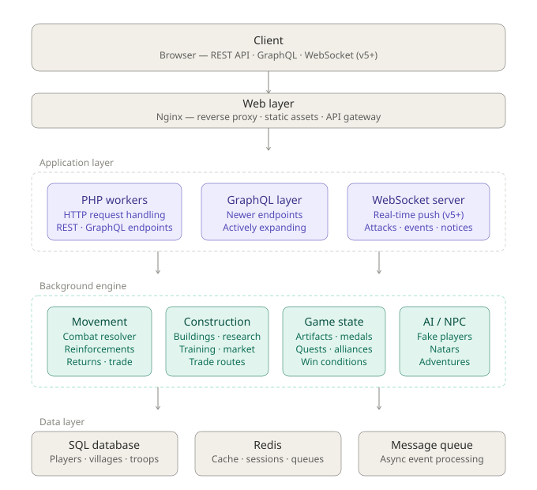

# Travian: Game Mechanics Research

> **Disclaimer:** This repository contains only original research notes, diagrams, and documentation produced through behavioral observation and network analysis. No original source code, assets, or proprietary material from Travian Games GmbH is included. See [DISCLAIMER.md](./DISCLAIMER.md) for full details.

---

## Overview

This is a personal R&D repository documenting my reverse engineering research on **Travian: Legends** and **Travian: Kingdoms** — two of the most well-known browser-based MMO strategy games.

The research was conducted entirely through:
- Behavioral observation during gameplay
- Network traffic analysis (browser DevTools, HTTP inspection)
- Frontend JavaScript analysis (public, client-side code)
- Statistical testing and pattern recognition on in-game data

The goal was to understand the underlying architecture, game engine design, and mathematical models that power the game — for educational and professional development purposes.

  
  

---

## What's Inside

| Section | Description |
|---|---|
| [`docs/architecture/`](./docs/architecture/) | Tech stack analysis, server architecture, infrastructure hypothesis |
| [`docs/game-mechanics/`](./docs/game-mechanics/) | Combat formulas, hero mechanics, building & resource systems |
| [`docs/network-analysis/`](./docs/network-analysis/) | API patterns, request/response structure, protocol observations |
| [`diagrams/`](./diagrams/) | Architecture diagrams, ERDs, sequence diagrams, flow charts |

---

## Key Findings

### Infrastructure & Architecture
- **Backend:** PHP-based application server
- **Web server / Proxy:** Nginx (likely used as reverse proxy / API gateway)
- **Containerization:** Docker + Kubernetes (inferred from deployment behavior and job postings)
- **Database:** Hybrid SQL + NoSQL approach (relational data + caching/session layer)
- **Message Queue:** Redis or RabbitMQ for async task processing

### Game Engine
One of the most interesting findings is the presence of a **server-side game processing daemon** — a background process that handles all time-based and parallel game operations:
- Attack and raid processing
- Building construction queues
- Resource production calculations
- Troop training timers

This daemon communicates through a message queue (Redis/RabbitMQ), enabling parallel processing of thousands of simultaneous game events across all players.

### Game Mechanics
- Reverse-engineered **combat formulas** for attack/defense calculations
- Reverse-engineered **Hero mechanics** including stat scaling and bonus formulas
- Documented **building upgrade timings** and resource production rates

---

## Research Methodology

All findings were obtained through **passive observation and analysis** — no exploitation, no unauthorized access, no server-side interaction beyond normal gameplay.

Tools and techniques used:
- Browser DevTools (Network tab, JS debugger)
- HTTP traffic inspection
- Systematic in-game testing with controlled variables
- Statistical analysis of observed outputs to infer underlying formulas

---

## About

This research was done as part of my personal professional development as a Full-Stack Developer and CTO. Understanding how large-scale, real-time game backends are architected — especially around concurrency, queuing, and distributed processing — directly informs how I design systems in my own work.

If you find this research interesting or want to discuss game backend architecture, feel free to reach out.

---

## License

All content in this repository is original work produced by the author.  
This project is licensed under [CC BY-NC 4.0](https://creativecommons.org/licenses/by-nc/4.0/) — free to use for non-commercial and educational purposes with attribution.

No proprietary material from Travian Games GmbH is included. All trademarks belong to their respective owners.
